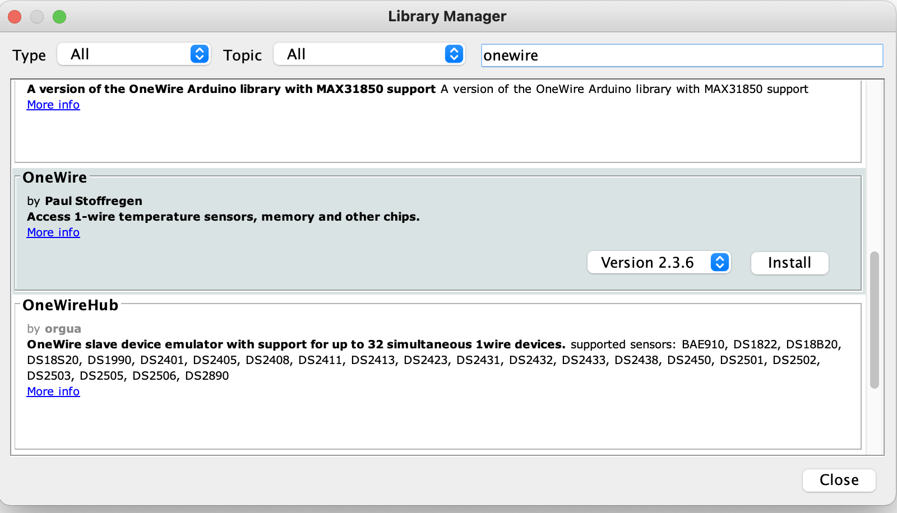
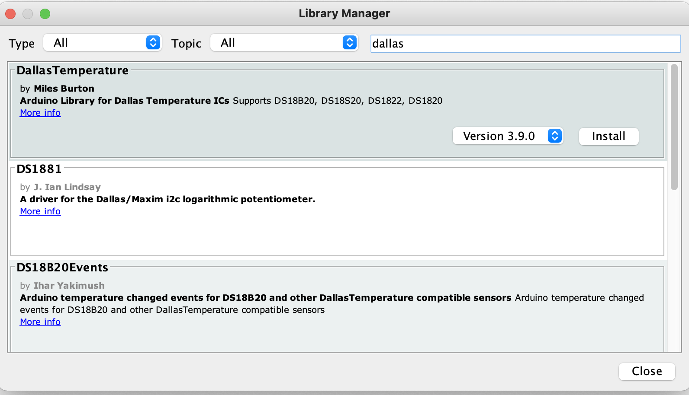

## ------- Setting up your ESP SIDE -------  
  
  
  
### 1) First make sure everything is ready for ESP8266
Try some tutorials like this:  
https://randomnerdtutorials.com/how-to-install-esp8266-board-arduino-ide/

### 2) Install missing Arduino libraries
Sketch -> Include Library -> Manage Libraries...  

Install library "OneWire"  

 

Install library "DallasTemperature"  
  
  
  
  
  
  
### 3) Set your WiFi and Zabbix information
  
ZABBIXAGHOST is Hostname in Zabbix system e.g.: ESP  
ZABBIX_KEY is Key in Zabbix system e.g.: ServerRoom
  
### 4) Connecting DS18B20 physically  
  
  
  
  
