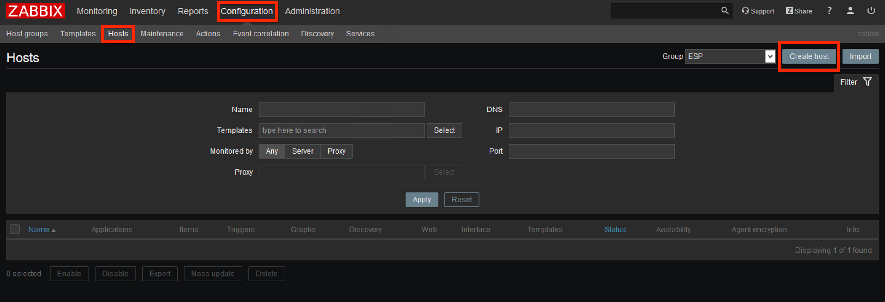
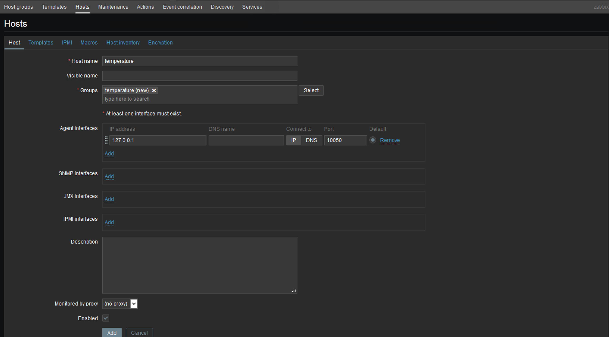
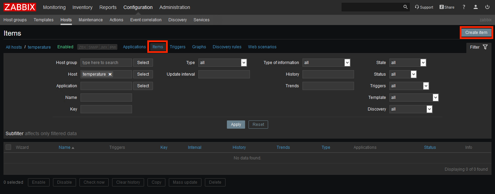
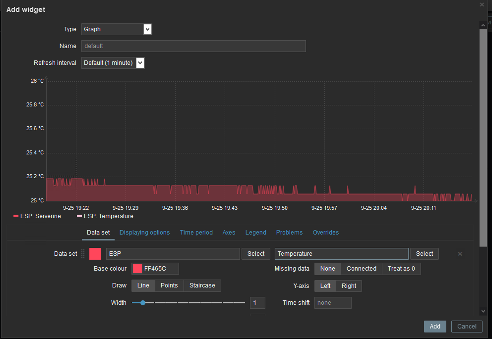

## ------- Setting up your Zabbix SIDE -------
  
  
### 1) Now lets add host to Zabbix
Click on Configuration->Hosts->Create host  
Then set up required fields:  
  
  
  
Hostname - create name for your host   e.g.:  ESP
Groups - set group you want or create new one  
Agent interfaces - (IP address and Port).  
  
And Click add  
  
  
  
### 2) Add item to host
Now when we have host we need to add item that we want to get from it. In our case - temperature.  
  
Select created host Configuration->Hosts-> YOUR_HOST  
if you cannot see your host select group at top-right  
  
Click Items->Create item  
  
  
  
Fill required fields:  
  
Name - ZABBIX_KEY  
Type - Zabbix trapper  
Type of information - Numeric (float)  
*optional Units - °C or °F  
  
  
### 3) View data ;)
Host are ready to use. Now we can view data in widgets  
  
Open your dashboard (Or create new one)-> add widget -> graph  
  
  
set dataset:  
host pettern - host created at step 1.  
item pattern- item created at step 2.  
